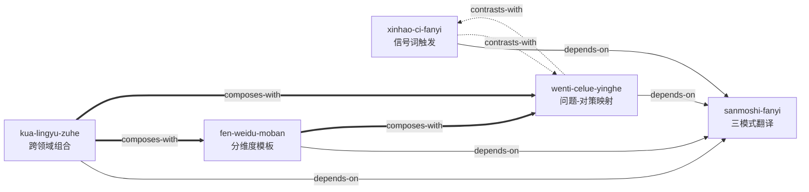

# 申论规范词积累课程 — Skill Index

> 本书由 cangjie-skill 蒸馏, 共产出 **5** 个 skills。
> 处理时间: 2026-07-09

## 关于这本书

- **来源**: 公考培训机构课程材料
- **模块**: 8大政策领域（教育、产业、治理、民生、生态、文化、执法、人才）
- **术语总量**: 128个规范词
- **一句话主旨**: 将口语化的材料描述翻译为精准的政策规范表达，并按维度组织成完整答案
- **整书理解**: 见 [BOOK_OVERVIEW.md](./BOOK_OVERVIEW.md)
- **术语词典**: [GLOSSARY.md](./GLOSSARY.md) — 128条规范词完整释义与近义区分

---

## Skill 列表 (按学习顺序分组)

### 第一层: 基础翻译

- [`sanmoshi-fanyi`](./skills/sanmoshi-fanyi/SKILL.md) — 三模式翻译框架：现象→术语、做法→概括、问题→定性，是整个体系的最底层方法论

### 第二层: 提速 + 精准 (可并行学习)

- [`xinhao-ci-fanyi`](./skills/xinhao-ci-fanyi/SKILL.md) — 信号词→规范词触发链：建立条件反射式的关键词映射，把翻译从推理变成检索
- [`wenti-celue-yinghe`](./skills/wenti-celue-yinghe/SKILL.md) — 问题-对策映射与近义区分：在多个候选规范词中通过定义+场景双重校验选出最精准的一个

### 第三层: 结构化答题

- [`fen-weidu-moban`](./skills/fen-weidu-moban/SKILL.md) — 分维度对策模板：5套预制维度模板（人才引-育-留、生态补偿-修复-预防、产业标准-渠道-品牌等），确保答案不遗漏关键维度

### 第四层: 综合组织

- [`kua-lingyu-zuhe`](./skills/kua-lingyu-zuhe/SKILL.md) — 跨领域组合答题法：处理多领域交叉材料（文旅融合、校企合作等），按逻辑链组织完整答案

---

## 引用图



图例:
- `-->` depends-on（前置依赖）
- `-.->` contrasts-with（对比互补）
- `===>` composes-with（组合使用）

---

## 推荐学习顺序

(从依赖图的叶子节点开始, 向上)

1. **sanmoshi-fanyi** — 最基础, 没有前置依赖。先掌握"口语→规范词"的三条翻译路径
2. **xinhao-ci-fanyi** + **wenti-celue-yinghe** (可并行) — 前者提速（信号词快速匹配），后者提精度（近义区分校验），分别解决"快"和"准"的问题
3. **fen-weidu-moban** — 在会翻译、会选词的基础上，学会用维度模板确保答案覆盖完整
4. **kua-lingyu-zuhe** — 最终整合：跨领域组合 + 逻辑链串联，从"选对词"跨越到"排好队"

---

## 关系总览 (9条)

| From | To | 关系 | 说明 |
|------|-----|------|------|
| wenti-celue-yinghe | sanmoshi-fanyi | depends-on | 先会翻译，才能精准选词 |
| wenti-celue-yinghe | xinhao-ci-fanyi | contrasts-with | 精度 vs 速度 |
| xinhao-ci-fanyi | sanmoshi-fanyi | depends-on | 信号词触发是翻译的快速通道 |
| xinhao-ci-fanyi | wenti-celue-yinghe | contrasts-with | 速度 vs 精度 |
| fen-weidu-moban | sanmoshi-fanyi | depends-on | 模板内的规范词需要先翻译出来 |
| fen-weidu-moban | wenti-celue-yinghe | composes-with | 模板选维度 + 映射选词配合使用 |
| kua-lingyu-zuhe | sanmoshi-fanyi | depends-on | 组合前提是已翻译出各领域规范词 |
| kua-lingyu-zuhe | fen-weidu-moban | composes-with | 跨领域时需要维度模板确保覆盖 |
| kua-lingyu-zuhe | wenti-celue-yinghe | composes-with | 组合后需要精准选词 |

---

## 安装使用

本目录是构建产物, 宿主不会从这里加载 skill。要让 agent 真正调用, 把 skill 目录复制到宿主的 skills 目录:

```bash
# 用户级 (所有项目可用)
cp -r skills/sanmoshi-fanyi ~/.claude/skills/
cp -r skills/xinhao-ci-fanyi ~/.claude/skills/
cp -r skills/wenti-celue-yinghe ~/.claude/skills/
cp -r skills/fen-weidu-moban ~/.claude/skills/
cp -r skills/kua-lingyu-zuhe ~/.claude/skills/

# 或项目级
cp -r skills/sanmoshi-fanyi <project>/.claude/skills/    # Claude Code
cp -r skills/sanmoshi-fanyi <project>/.cursor/skills/    # Cursor
```

---

## 接入 darwin-skill

所有 skill 均带有 `test-prompts.json` (darwin-skill 兼容格式), 可直接接入自动进化:

```
darwin evolve books/gongwen-biazhunci/
```

---

## 审计轨迹

- 候选单元池: [candidates/](./candidates/)
- 术语词典: [GLOSSARY.md](./GLOSSARY.md)
- BOOK_OVERVIEW: [BOOK_OVERVIEW.md](./BOOK_OVERVIEW.md)
